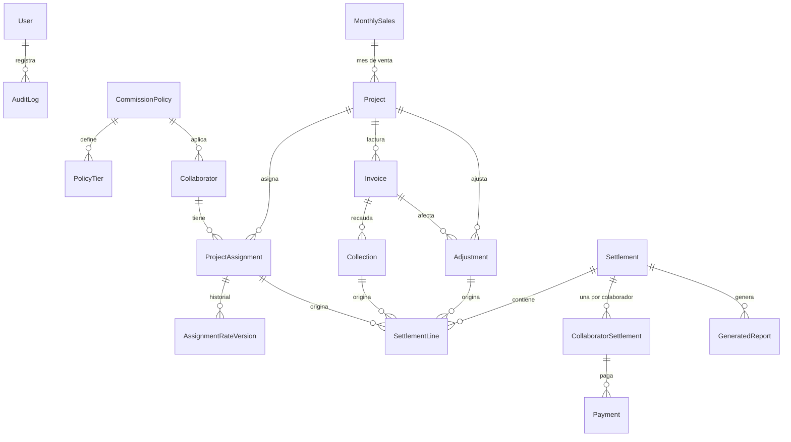

# Háptica Commission Manager — Fase 1: Diseño técnico

> **Actualización (octubre 2026):** la persistencia migró de PostgreSQL/Prisma a **Cloud Firestore** (ver [05-migracion-firestore.md](05-migracion-firestore.md)). Las referencias a PostgreSQL, Prisma, triggers y `CHECK` de este documento describen el diseño original; las reglas de negocio no cambiaron.

> Estado: **Implementado (Fases 1–5).** Este documento es el diseño original con los ajustes confirmados (sección 9.0); para el comportamiento exacto del motor y las limitaciones vigentes ver [02-motor-de-comisiones.md](02-motor-de-comisiones.md). Diferencias respecto al diseño inicial: sesión propia con `jose` en lugar de Auth.js; los ajustes de nota crédito/descuento reducen el valor de la factura; los recaudos se acotan a la base de la factura.
>
> Estado original: **Fase 1 aprobada con ajustes** (ver sección 9.0). Las decisiones **[D#]** que no aparecen en 9.0 siguen con su propuesta por defecto y se confirman antes de la Fase 3.

---

## 1. Alcance y principios

| Principio | Consecuencia de diseño |
|---|---|
| Dinero = precisión exacta | `Decimal` en BD (`NUMERIC`) y `decimal.js` en código. Prohibido `number` para valores monetarios o porcentajes. |
| El motor es independiente de la UI | Carpeta `src/domain` en TypeScript puro, sin imports de Next, React ni Prisma. Recibe datos, devuelve resultados. Se prueba sin base de datos. |
| Lo cerrado no se toca | Una liquidación aprobada guarda una **foto (snapshot)** de cada línea. Los cambios posteriores solo generan ajustes en liquidaciones futuras. |
| Nada se borra | Anulación lógica (`voidedAt`, `voidReason`) y bitácora de auditoría. |
| Un recaudo se paga una sola vez | Restricción única en base de datos, además de la validación en código. |
| Fechas de negocio ≠ instantes | Fechas de negocio (venta, emisión, recaudo) como `DATE` sin hora. Instantes (creación, aprobación) como `timestamptz` en UTC. Los cortes se calculan en `America/Bogota`. |

## 2. Stack y justificación

Mantengo tu stack de referencia. No encontré una alternativa más simple que justifique cambiarlo.

| Capa | Elección | Por qué |
|---|---|---|
| Framework | **Next.js (App Router) + React + TypeScript** | Un solo proyecto con UI, Server Actions y rutas para PDF/Excel. No hace falta un backend separado para una app interna. |
| UI | Tailwind CSS + shadcn/ui | Según lo pedido. Los componentes shadcn se personalizan con los tokens de marca. |
| BD / ORM | **PostgreSQL + Prisma** | `NUMERIC` exacto, transacciones, índices únicos parciales (clave para evitar pagos dobles). Ver **[D16]**: PostgreSQL no está instalado en este equipo. |
| Validación | Zod | Un mismo esquema para formulario (cliente) y Server Action (servidor). |
| Decimales | `decimal.js` | Aritmética decimal exacta con modo de redondeo explícito. |
| Fechas | `date-fns` + `date-fns-tz` | Cortes en `America/Bogota`. |
| Autenticación | Sesión propia con `jose` + `bcryptjs`, un usuario administrador | Suficiente para V1 y sin dependencias beta. El modelo ya incluye `User` y `role` para crecer. |
| PDF | `@react-pdf/renderer` | Corre en Node sin navegador, soporta paginación automática, encabezados/pies repetidos y `wrap={false}` para que las filas no se corten. |
| Excel | `exceljs` | Genera `.xlsx` con formato en el servidor. |
| Pruebas | Vitest (motor + integración con BD de prueba) | El motor se prueba sin BD. El cierre transaccional y el anti-duplicado se prueban contra PostgreSQL. |

## 3. Arquitectura en capas

```
┌──────────────────────────────────────────────────────────────┐
│ UI  (src/app, src/components, src/features/*)                │
│   Páginas, formularios, tablas. Solo llama a Server Actions. │
└───────────────▲──────────────────────────────────────────────┘
                │ DTOs validados con Zod
┌───────────────┴──────────────────────────────────────────────┐
│ Aplicación  (src/server/actions, src/server/services)        │
│   Casos de uso: crear proyecto, registrar recaudo, calcular  │
│   y cerrar liquidación. Abre transacciones, escribe auditoría│
└───────▲───────────────────────────────▲──────────────────────┘
        │ entidades                     │ datos planos
┌───────┴──────────────┐      ┌─────────┴────────────────────────┐
│ Datos (src/server/db)│      │ DOMINIO (src/domain) — PURO      │
│  Prisma, repositorios│      │  money, periods, eligibility,    │
│                      │      │  policies, allocation,           │
│                      │      │  settlement-calc, adjustments    │
└──────────────────────┘      └──────────────────────────────────┘
        Reportes (src/reports): PDF y Excel, leen SOLO snapshots de liquidación
```

Estructura de carpetas propuesta:

```
prisma/            schema.prisma · migrations/ · seed.ts
src/domain/        money.ts · tz.ts · periods.ts · eligibility.ts
                   policies/{general,gamification}.ts · allocation.ts
                   collection-commission.ts · adjustments.ts · settlement.ts
src/server/        actions/ · services/ · db/ · audit.ts · auth.ts
src/reports/       pdf/ · excel/
src/app/           (dashboard)/ proyectos/ facturas/ colaboradores/ liquidaciones/ configuracion/
tests/domain/      un archivo por escenario obligatorio
tests/integration/ cierre transaccional · doble pago · inmutabilidad
docs/              este documento · guía de instalación y uso
```

## 4. Modelo de datos

### 4.1 Convenciones

- IDs: `cuid` (texto). Además, códigos legibles donde aplica (`Project.code`, `Settlement.code` = `LIQ-2026-10`).
- Todas las tablas: `createdAt`, `updatedAt`, `createdById`, `updatedById`.
- Montos: `NUMERIC(20,2)`. Tasas de cambio: `NUMERIC(18,6)`. Porcentajes como **fracción** (`0.010000` = 1 %): `NUMERIC(8,6)`.
- Anulación: `voidedAt`, `voidedById`, `voidReason` en Project, Invoice, Collection, Adjustment.

### 4.2 Diagrama



### 4.3 Entidades

**`User`** — `email`, `passwordHash`, `name`, `role` (`ADMIN`).

**`CommissionPolicy`** (política) — `code` (`GENERAL`, `GAMIFICATION`), `name`, `kind` (`GENERAL_THRESHOLD` | `GAMIFICATION_TIERS`).
**`PolicyTier`** — para la política de gamificación: `policyId`, `minAchievement` (inclusivo), `factor`, con vigencia. El tramo aplicable es el de mayor `minAchievement` ≤ cumplimiento. Valores iniciales: 0–0,70 → 0 · 0,70–1,00 → 0,5 · 1,00–1,20 → 1 · ≥1,20 → 1,5. Así la escala se edita en Configuración sin tocar código, y Nicholle se identifica por `Collaborator.policyId`, no por su nombre.

**`Collaborator`** — `fullName`, `email`, `position`, `status` (`ACTIVE`|`INACTIVE`), `policyId`, `joinDate?`, `notes`. Sin borrado. Inactivar no toca derechos económicos.

**`MonthlyGoal`** (meta con vigencia) — `amountCOP`, `effectiveFrom`. Inicial: 390.000.000 desde el primer mes. Guardar vigencias evita reescribir la historia si la meta cambia.

**`ReferenceRate`** (tasa de referencia de venta) — `currency`, `date`, `rate`, `source`, `notes` (TRM del día de la venta). Se usa **solo** para contabilizar ventas en COP hacia la meta. Es independiente de las tasas de recaudo.

**`MonthlySales`** (cierre comercial del mes) — `yearMonth` único, `goalAmountSnapshot`, `computedSalesCOP` (suma de proyectos del mes), `manualAdjustmentCOP` + `manualAdjustmentReason`, `totalSalesCOP`, `achievementRatio`, `status` (`OPEN` | `VALIDATED` | `REOPENED`), `outcome` (`ELIGIBLE` | `NOT_ELIGIBLE`, nulo hasta validar), `outcomeReason`, `validatedAt/By`.

**`Project`** — `code` único, `name`, `client`, `country` (CO/CL/MX), `saleDate`, `saleMonthId` → `MonthlySales`, `currency`, `saleAmount` (sin IVA), `providerCosts` (sin IVA), `netBase` (calculada y guardada; restricción `>= 0`), `saleReferenceRate`, `saleAmountCOP`, `expectedInvoices`, `notes`.
Estado de elegibilidad **derivado** del mes (`PENDING_VALIDATION` | `ELIGIBLE` | `NOT_ELIGIBLE`) más el motivo legible. Estados de facturación y recaudo **derivados** de facturas/recaudos (nunca editables a mano).

**`ProjectAssignment`** — `projectId`, `collaboratorId`, `baseRate` (≤ 0,01 salvo política `GAMIFICATION`), `effectiveRate` (nulo hasta validar el mes), `effectiveRateRule` (texto/JSON con la regla aplicada: «gamificación: cumplimiento 112 % → factor 1»). Único `(projectId, collaboratorId)`.
**`AssignmentRateVersion`** — historial inmutable de `baseRate` por asignación (valor, fecha, usuario, motivo).

**`Invoice`** — `projectId`, `number`, `issueDate`, `currency`, `amountPreTax`, `netBaseAllocated` (explícita u obtenida por prorrata, ver D6), `status` (`DRAFT`|`ISSUED`|`VOID`), `dueDate?`, `notes`. Único `(projectId, number)`. Se permiten facturas *previstas* (`DRAFT`) para la cantidad esperada.

**`Collection`** (recaudo) — `invoiceId`, `date`, `amountReceived`, `currency`, `fxRate`, `amountCOP` (= `amountReceived × fxRate`, guardado para auditoría), `isOverpaymentAdjustment` + `justification`, `notes`. `amountReceived` se registra **sin IVA**. Restricción: Σ `amountReceived` ≤ `Invoice.amountPreTax` salvo ajuste justificado.

**`Adjustment`** — `projectId`, `invoiceId?`, `date`, `kind` (`CREDIT_NOTE` | `DISCOUNT` | `CONTRACT_REDUCTION` | `PROVIDER_COST`), `reason`, `amount` (reducción de base, positiva), `currency`, `createdById`, `status` (`PENDING` | `APPLIED`), `appliedInSettlementId?`.

**`Settlement`** (liquidación) — `code` único (`LIQ-2026-10`), `year`, `half` (`APRIL`|`OCTOBER`), `periodStart`, `periodEnd`, `paymentDate`, `status` (`DRAFT` | `APPROVED`), totales, `calculatedAt`, `approvedAt/By`. Único `(year, half)`.

**`SettlementLine`** — una por (recaudo × colaborador) o por ajuste: `settlementId`, `collaboratorId`, `projectId`, `invoiceId?`, `collectionId?`, `adjustmentId?`, `assignmentId`, `type` (`COLLECTION` | `ADJUSTMENT`), `baseRate`, `effectiveRate`, `currency`, `fxRate`, `netBaseOriginal`, `netBaseCOP`, `commissionCOP`, `snapshot` (JSON con todo lo mostrado en el PDF: nombres, fechas, valores), `committed` (verdadero al aprobar).
**Anti pago doble:** índice único parcial `UNIQUE (collectionId, assignmentId) WHERE type = 'COLLECTION' AND committed`. Impide en base de datos que un mismo recaudo se liquide dos veces para la misma asignación, sin depender solo del código.

**`CollaboratorSettlement`** — `settlementId`, `collaboratorId`, `grossCommission`, `adjustmentsTotal`, `netPayable`, `approvalStatus`, `paymentStatus` (`PENDING`|`PAID`). Único `(settlementId, collaboratorId)`.
**`Payment`** — `collaboratorSettlementId`, `paidAt`, `amount`, `reference`, `notes`. Único `(reference)` por liquidación; la suma de pagos no puede superar `netPayable`.

**`GeneratedReport`** — `settlementId`, `collaboratorId?`, `kind`, `generatedAt`, `sha256`. Los PDF se regeneran desde los snapshots, de modo que un reporte de una liquidación cerrada siempre sale igual.

**`AuditLog`** — `entity`, `entityId`, `action`, `before` (JSON), `after` (JSON), `userId`, `at`. Se escribe en la misma transacción que el cambio.

## 5. Motor de comisiones — reglas formalizadas

Notación: `B` = base neta del proyecto = venta sin IVA − costos de proveedores (≥ 0).

### 5.1 Elegibilidad (se decide una vez, en el mes de venta)

1. `ventasMes (COP)` = Σ `saleAmountCOP` de **todos** los proyectos del mes (con o sin colaboradores comisionables) ± ajuste manual justificado. **[D1][D2]**
2. `cumplimiento = ventasMes / meta` (decimal exacto, sin redondeo antes de comparar).
3. **Política general:** el proyecto es `ELIGIBLE` si `ventasMes >= meta` (**inclusivo**, decisión del 2026-10-05: con exactamente 390.000.000 todos cobran). Reemplaza la regla original «superar estrictamente».
4. **Política de gamificación:** no usa la compuerta anterior; usa los tramos de `PolicyTier` sobre `cumplimiento`. Los límites son inclusivos por abajo: 70 % → 0,5; 100 % → 1; 120 % → 1,5. **[D4]**
5. El estado queda fijo al validar el mes. Los meses posteriores no lo reevalúan.

### 5.2 Porcentaje

- `baseRate`: el asignado en la venta, ≤ 1 % (excepto gamificación). Constante durante el proyecto, con historial.
- `effectiveRate` general = `baseRate` si es elegible, 0 si no.
- `effectiveRate` gamificación = `baseRate × factor(cumplimiento)`. **[D4]**
- Se guardan ambos y la regla aplicada.

### 5.3 Comisión por recaudo

Por cada recaudo no anulado de factura emitida, de proyecto elegible, por cada asignación:

```
netBaseDelRecaudo  = amountReceived × (invoice.netBaseAllocated / invoice.amountPreTax)   [moneda del proyecto; el recaudo se registra SIN IVA]
comisión (moneda)  = netBaseDelRecaudo × effectiveRate
comisión (COP)     = comisión (moneda) × collection.fxRate          (COP: fxRate = 1)
```

- `netBaseAllocated` por defecto = `amountPreTax × B / saleAmount` (prorrata de costos); se puede fijar explícitamente por factura, y Σ de las facturas debe cuadrar con `B`. **[D6]**
- Recaudo parcial → solo la fracción recibida genera comisión. El resto genera comisión cuando se recaude.
- Sobrerecaudo (ajuste justificado) no genera comisión adicional. **[D11]**
- **Sin redondeo de negocio** (D8): se calcula con `decimal.js` a 40 cifras significativas y se persiste con `NUMERIC(24,6)`; los totales suman las líneas tal cual. La interfaz muestra 2 decimales.

### 5.4 Período de liquidación

Por **fecha efectiva del recaudo**, en fechas Bogotá, límites inclusivos:

| Liquidación | Período | Pago |
|---|---|---|
| Abril de *Y* | 1-oct-(*Y*−1) → 31-mar-*Y* | 15-abr-*Y* |
| Octubre de *Y* | 1-abr-*Y* → 30-sep-*Y* | 15-oct-*Y* |

Un recaudo cuya fecha cae en un período ya cerrado (registrado tarde) entra en la siguiente liquidación abierta y se marca como *extemporáneo*. **[D10]**

### 5.5 Ajustes (notas crédito, descuentos, costos)

- Reducen `netBaseAllocated` de la factura afectada (o `B` si no hay factura; se reparte por prorrata).
- Efecto en recaudos aún no liquidados: las comisiones se recalculan con la base ajustada.
- Efecto en recaudos ya liquidados: nunca se reescribe la línea cerrada. Se crea una **línea de ajuste negativa** en la siguiente liquidación abierta, con la diferencia entre lo liquidado y lo que correspondería con la nueva base. **[D9]**
- Un ajuste queda `PENDING` hasta incluirse en una liquidación aprobada.

### 5.6 Cálculo de la liquidación y cierre

1. **Calcular** (borrador): el motor recibe recaudos del período + asignaciones + ajustes pendientes y devuelve líneas. Es repetible: recalcular reemplaza el borrador.
2. **Revisar:** alertas = proyectos `PENDING_VALIDATION`, recaudos sin tasa, facturas incompletas, ajustes pendientes, posibles duplicados (mismo número/monto/fecha), diferencia entre `Σ netBaseAllocated` y `B`.
3. **Aprobar** (una transacción): recalcula, verifica que no haya alertas bloqueantes sin reconocer, congela snapshots, marca líneas `committed` (activa el índice único), crea `CollaboratorSettlement`, marca ajustes `APPLIED`, escribe auditoría. Si algo falla, no queda nada a medias.
4. **Inmutabilidad:** tras aprobar, ninguna acción de la aplicación puede modificar líneas, totales ni snapshots (se impide en la capa de servicio y con un trigger en BD).
5. **Pago:** registrar `Payment` por colaborador, sin superar `netPayable`. Aprobación y pago son estados distintos.

### 5.7 Definiciones del dashboard (no son categorías sumables) **[D14]**

Son subconjuntos anidados, no columnas independientes:

```
Potencial (proyectos elegibles o por validar × base × %)
  ⊇ Generada  (la parte ya facturada y recaudada)
      ⊇ Liquidada (aprobada en una liquidación cerrada)
          ⊇ Pagada (pago registrado)
Pendiente de pago = Generada − Pagada
```

## 6. Auditoría y seguridad

- `AuditLog` en la misma transacción que cada cambio relevante (proyectos, porcentajes, facturas, recaudos, tasas, ajustes, validación de meses, liquidaciones, pagos).
- Sin `DELETE` sobre entidades con movimientos. Anulación con motivo obligatorio.
- Contraseña con hash (bcrypt), sesión JWT firmada (`jose`) en cookie `httpOnly` (se descartó Auth.js: sigue en beta y para un único administrador añade complejidad sin beneficio), todas las Server Actions verifican sesión.
- Validación Zod en cliente y servidor; restricciones `CHECK` en BD (base ≥ 0, porcentajes dentro de rango, montos positivos).

## 7. Experiencia de usuario (resumen)

- Navegación lateral con los seis módulos. Dashboard con tarjetas de indicadores y un gráfico mensual de ventas contra la meta de 390 M.
- Proyecto en una sola pantalla: datos generales → colaboradores y % → facturas previstas. La base neta se muestra en vivo.
- Recaudos se registran desde la fila de la factura, con tasa y equivalente en COP calculados en pantalla.
- Liquidaciones en asistente de 6 pasos con totales siempre visibles; confirmación explícita antes de aprobar y antes de registrar pagos.
- Todos los estados con color + texto y un enlace «ver motivo».

## 8. Plan de fases

| Fase | Entrega | Criterio de salida |
|---|---|---|
| 1 | Este documento aprobado + decisiones | Respondes la sección 9. |
| 2 | Proyecto Next.js, tema, navegación, componentes, formularios y tablas | La app abre, navega y guarda datos básicos. |
| 3 | `src/domain` + 15 escenarios de prueba | Todas las pruebas en verde. |
| 4 | Asistente de liquidación, cierre transaccional, PDF y Excel | Una liquidación de demo de principio a fin. |
| 5 | Datos de ejemplo, verificación manual, documentación | Guía de instalación y uso. |

Los escenarios 11 y 12 (nota crédito posterior a la liquidación; doble liquidación) se prueban en integración contra PostgreSQL, no solo en el motor puro.

## 9. Decisiones

### 9.0 Confirmadas (2026-10-05)

| # | Decisión |
|---|---|
| D1 | La venta que cuenta para la meta es la venta **sin IVA** (sin descontar costos de proveedores). |
| D4 | La escala de Nicholle **reemplaza** la compuerta general y es un **multiplicador** del porcentaje base. **Cambio de regla:** la meta se cumple con ventas **≥ $390M** (inclusivo). Con exactamente $390M todos cobran su porcentaje asignado; Nicholle, 1 %. El escenario de prueba 3 se redefine: «con $390M exactos sí hay derecho a comisión». |
| D5 | El recaudo se registra **sin IVA**. No existe campo separado de «valor aplicado». |
| D8 | **Sin redondeo**: se paga el valor exacto (decimal de alta precisión, 6 decimales persistidos, 2 en pantalla). |
| D9, D10 | Aceptadas: ajuste negativo en la siguiente liquidación abierta, saldo negativo arrastrado, recaudos tardíos a la siguiente liquidación abierta. |
| D13 | Tasa del recaudo = **TRM del día del recaudo**. Para la tasa de referencia de venta (meta) asumo la **TRM del día de la venta**, ingresada manualmente por proyecto. *Pendiente de confirmar.* |
| D16 | Despliegue en GitHub. *Requiere aclaración:* GitHub Pages solo sirve sitios estáticos y no puede ejecutar esta app (servidor + PostgreSQL). Para desarrollo uso un PostgreSQL embebido dentro del proyecto, sin instalar nada en el sistema. |
| Resto | Las demás propuestas por defecto (D2, D3, D6, D7, D11, D12, D14, D15, D17, D18) siguen vigentes. |

### 9.1 Detalle original de las decisiones

Cada una trae mi propuesta por defecto. «Bloquea» indica la fase que no puedo terminar sin tu respuesta.

### Reglas de negocio

| # | Pregunta | Propuesta por defecto | Bloquea |
|---|---|---|---|
| **D1** | ¿Qué valor de venta cuenta para la meta mensual? | Valor de venta **sin IVA y sin descontar costos de proveedores**, de todos los proyectos del mes y países, convertido a COP con la tasa de referencia. | Fase 3 |
| **D2** | ¿Cómo se registran las «ventas organizacionales mensuales»? | Se calculan desde los proyectos registrados, con un ajuste manual opcional y justificado (ventas que no están como proyecto). El administrador **valida** cada mes cuando termina; hasta entonces sus proyectos quedan «Pendiente de validación». | Fase 3 |
| **D3** | Si después de validar un mes se edita o agrega un proyecto de ese mes, ¿qué pasa? | Un mes validado queda bloqueado. Para cambiarlo hay que **reabrirlo** con motivo (queda auditado). No se permite reabrir si hay recaudos ya liquidados de ese mes. | Fase 3 |
| **D4** | Política de Nicholle: (a) ¿la escala **reemplaza** la compuerta general (a ella le pagan desde 70 %, aunque no se supere la meta)? (b) ¿la escala es un **multiplicador** del porcentaje base (0 / 0,5× / 1× / 1,5×) o un porcentaje absoluto? (c) ¿qué pasa si su base asignada no es 1 %? | (a) Sí, la reemplaza. (b) Multiplicador. (c) Solo se admiten asignaciones de 1 % base; otra cifra se bloquea hasta que definas la regla. Nota: con ventas de exactamente 390 M, la política general paga 0 y ella cobra 1 %. Es consecuencia de tus reglas; lo señalo para que confirmes que es intencional. | Fase 3 |
| **D5** | Un recaudo en la vida real incluye IVA y puede traer retenciones. ¿Cómo registramos el recaudo? | Se registra el **valor recibido** y aparte el **valor aplicado a la factura antes de impuestos** (`appliedPreTax`). La comisión usa este último. Las retenciones no reducen la base (la factura se considera recaudada por su valor completo). | Fase 3 |
| **D6** | Distribución de costos de proveedores entre facturas. | Prorrata por defecto (`base neta ÷ venta`). Opcionalmente se fija la base neta de cada factura a mano; el sistema exige que las facturas sumen la base neta del proyecto. | Fase 3 |
| **D7** | Moneda de costos, facturas y recaudos en proyectos extranjeros. | Todos en la **moneda del proyecto**. La conversión a COP ocurre solo con la tasa de cada recaudo. No admito recaudos en moneda distinta a la de la factura en V1. | Fase 3 |
| **D8** | Redondeo. | Cálculo en decimal exacto; se redondea **una vez por línea** a pesos enteros (mitad hacia arriba). Los totales son la suma de líneas ya redondeadas. | Fase 3 |
| **D9** | Mecánica de ajustes ya liquidados y saldos negativos. | Línea negativa en la siguiente liquidación abierta (ver 5.5). Si el neto de un colaborador resulta negativo, el saldo se **arrastra** a la siguiente liquidación (no se genera deuda). La conversión de la parte ya liquidada usa las tasas de los recaudos originales. | Fase 3 |
| **D10** | Recaudo registrado tarde con fecha en un período ya cerrado. | Entra en la siguiente liquidación abierta, marcado como extemporáneo. | Fase 4 |
| **D11** | Sobrerecaudo con ajuste justificado. | No genera comisión adicional; la comisión nunca supera la base neta. | Fase 3 |
| **D12** | ¿Se pueden corregir los porcentajes de una asignación después de la venta? | Solo mediante nueva versión con motivo, y **no** si ya existe un recaudo liquidado del proyecto. | Fase 3 |
| **D13** | Tasa de referencia de venta. | Una tasa por moneda y mes, ingresada manualmente (¿la TRM promedio o la del cierre del mes?), con posibilidad de fijar una tasa específica por proyecto. Necesito que me digas la fuente que usan. | Fase 3 |
| **D14** | Definiciones del dashboard. | Las de la sección 5.7. | Fase 2 |
| **D15** | ¿Existe un tope a la suma de porcentajes de todos los colaboradores en un proyecto? | No lo impongo, porque no lo dijiste. Solo aplico el tope de 1 % por persona. | Fase 2 |

### Infraestructura y marca

| # | Pregunta | Propuesta por defecto |
|---|---|---|
| **D16** | **PostgreSQL no está instalado** en este equipo y tampoco Docker. ¿Cómo lo resolvemos? ¿Dónde se desplegará la app (equipo local, servidor propio, nube)? | Instalar PostgreSQL 16 localmente para desarrollo (instalador oficial de Windows) y dejar la configuración por variable de entorno, de modo que pasar a un PostgreSQL alojado sea solo cambiar la URL. Los datos son financieros: recomiendo definir el destino de despliegue antes de la Fase 5. |
| **D17** | **Marca.** Tu brief pide «verde petróleo» y «bordes suaves»; el design system de Háptica define verde profundo `#003237` (Pantone 7477 C) para piezas Legal Design, acento naranja `#FA4616`, menta `#00BCA0`, Gotham, y esquinas cuadradas sin sombras (radio 8 px solo en UI como inputs y diálogos). ¿Qué prefieres? | Usar el design system: verde profundo como color principal, naranja como acento, tarjetas planas con borde fino y radio de 8 px en elementos de UI. Gotham requiere licencia web; propongo Montserrat como alternativa si no la tenemos. Necesito además el **logotipo** y el **PDF de referencia** (aún no han llegado). |
| **D18** | Autenticación. | Un administrador. Las credenciales iniciales se leen de variables de entorno (`.env`) y no quedan en el código. |

## 10. Qué NO está en la V1

Integración con servicios de tasas de cambio, firma electrónica propia, permisos por rol, múltiples usuarios con auditoría diferenciada (el modelo ya lo soporta, la interfaz no), envío de correos. Cualquier módulo que no esté terminado se mostrará como «Pendiente», no simulado.
